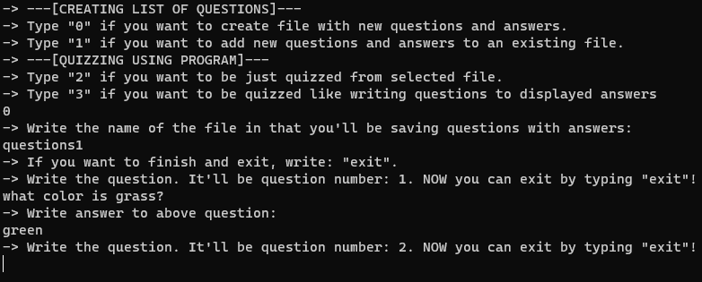
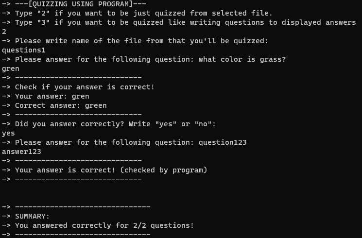

## Answer to Questions. Simply and useful project!

* [Idea](#idea)
* [Description](#description)
* [Technologies](#technologies)
* [Requirements](#requirements)
* [Screenshots](#screenshots)

# Idea
I really needed simply app allows me fastly create list of questions with answer and quizz me using program. So... I made it! I personally use this program to learn e.g. words in foreign language.

# Description
It's a terminal-based app created in Java. App allows to among other things:
* create lists of questions with answers saved in YAML text files.
* be quizzed by the application from a selected list of questions (from YAML text file) in a random order.
* be quizzed in reverse order (like you have to write correct questions for displayed answers).
* add new questions and answers to an  existing file.

# Technologies
* SnakeYAML (version 2.0)

# Requirements
* Java 17 (or higher)

# Screenshots
## Creating list of questions and answers (mode 0):

## Quizzing yourself using program (mode 2):

